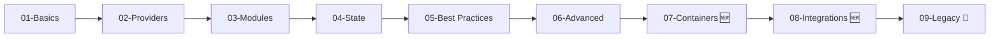

# 🚀 Modern Infrastructure as Code for Windows Admins
## Terraform Mastery Course - Interactive Lab

[](https://www.terraform.io/)
[](https://www.microsoft.com/windows)
[](https://docs.microsoft.com/powershell/)
[](https://www.docker.com/)
[](https://kubernetes.io/)

Welcome to the **Interactive Terraform Learning Lab** designed specifically for Windows administrators transitioning to modern Infrastructure as Code practices!

## 🎯 What Makes This Lab Special?

- **🪟 Windows-First Design**: Built by Windows admins, for Windows admins
- **🎮 Interactive Learning**: Guided exercises with real-time validation
- **📊 Progress Tracking**: Achievement system and completion certificates
- **🔧 PowerShell Native**: All automation in familiar PowerShell
- **🚀 Modern & Legacy**: Covers both cutting-edge and enterprise reality
- **💡 Smart Hints**: Get help when you're stuck
- **✅ No Admin Required**: Learn without elevation (mostly!)

## 🏃 Quick Start

```powershell
# 1. Clone the repository
git clone https://github.com/evilrakir/iac_lab.git
cd iac_lab

# 2. Create your personal workspace
.\Setup-Lab.ps1

# 3. Start the interactive lab
cd username-workspace
..\Start-TerraformLab.ps1
```

That's it! The interactive system will guide you through everything else.

## 📚 What You'll Learn

### Core Skills (Everyone)
- ✅ Terraform fundamentals and syntax
- ✅ Variables, outputs, and state management
- ✅ Modules and reusable components
- ✅ Best practices and patterns

### Modern Technologies (Priority)
- 🐋 Docker container management with Terraform
- ☸️ Kubernetes deployments and configurations
- 🔄 CI/CD pipeline integration
- 🔗 Ansible + Terraform integration
- ☁️ Multi-cloud deployments (AWS, Azure, GCP)

### Legacy/Enterprise (Optional)
- 📦 Vagrant (marked as legacy)
- 👴 Chef/Puppet (traditional config management)
- 🖥️ On-premise virtualization

## 🎓 Learning Path



## 🛠️ Prerequisites

### Required
- Windows 10/11 or Windows Server 2016+
- PowerShell 5.1 or higher
- Internet connection (for provider downloads)

### Will Be Installed
- Terraform (if not present)
- Supporting tools as needed

### Optional but Recommended
- Docker Desktop
- VS Code
- Git

## 📁 Repository Structure

```
iac_lab/
├── 📄 GETTING_STARTED.md       # Start here for detailed setup
├── 🚀 Start-TerraformLab.ps1   # Interactive lab runner
├── 🔧 Setup-Lab.ps1            # Workspace initialization
├── 📂 01-basics/               # Fundamental concepts
├── 📂 07-containers/           # Modern container tech
├── 📂 08-integrations/         # Tool integrations
├── 📂 09-legacy-optional/      # Legacy technologies
├── 📂 scripts/                 # Supporting automation
│   ├── Check-Environment.ps1
│   ├── Install-LabTools.ps1
│   └── modules/
└── 📂 username-workspace/      # YOUR WORK (git-ignored)
```

## 🎮 Interactive Features

### Real-Time Validation
```powershell
# The lab validates your work automatically
✅ Terraform initialized
✅ Resources created
✅ Outputs configured
🎉 Exercise complete!
```

### Progress Tracking
```powershell
# Track your journey
Progress: 8/20 exercises completed (40%)
[████████████░░░░░░░░░░░░] 40%
```

### Achievement System
- ⭐ First Steps - Complete your first exercise
- ⭐⭐ Infrastructure Builder - Complete 5 exercises
- ⭐⭐⭐ Terraform Practitioner - Complete 10 exercises
- 🌟 Terraform Master - Complete ALL exercises!

### Completion Certificates
Generate beautiful certificates of completion to showcase your achievement!

## 💡 For Windows Admins

This lab bridges your existing knowledge with modern practices:

| Windows/PowerShell | Terraform Equivalent |
|-------------------|---------------------|
| PowerShell DSC | Terraform Configuration |
| `-WhatIf` | `terraform plan` |
| MOF Files | State Files |
| PS Modules | Terraform Providers |
| `Install-Module` | `terraform init` |

## 🤝 Contributing

Found an issue? Have a suggestion? We'd love to hear from you!

1. Open an issue: [GitHub Issues](https://github.com/evilrakir/iac_lab/issues)
2. Submit a PR with improvements
3. Share your success stories!

## 📝 License

This educational lab is provided as-is for learning purposes. Feel free to use, modify, and share!

## 🙏 Acknowledgments

Built with ❤️ for the Windows admin community, bridging traditional IT with modern DevOps practices.

---

**Ready to transform your infrastructure management skills?**

👉 **[Start with GETTING_STARTED.md](GETTING_STARTED.md)** 👈

---

*🔧 PowerShell Native | ☁️ Cloud Ready | 🐋 Container First*